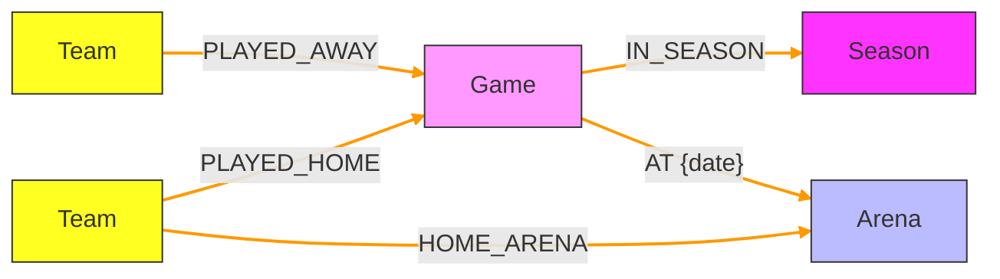
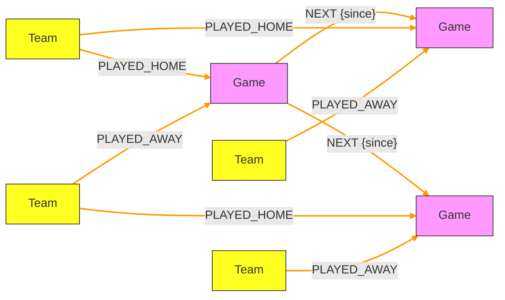

# Game Architecture

```mermaid
graph LR
    linkStyle default stroke:#ff9900,stroke-width:2px;

    S[Season]
    style S fill:#f3f,stroke:#333

    G[Game]
    style G fill:#f9f,stroke:#333

    ht[Team]
    at[Team]
    style ht fill:#ff2,stroke:#333
    style at fill:#ff2,stroke:#333

    a[Arena]
    style a fill:#bbf,stroke:#333

    G -- IN_SEASON --> S
    G -- AT {date} --> a 
    at -- PLAYED_AWAY --> G
    ht -- PLAYED_HOME --> G
    ht -- HOME_ARENA --> a
```

## Time Chain with `NEXT`

```mermaid
graph LR
    linkStyle default stroke:#ff9900,stroke-width:2px;

    G[Game]
    style G fill:#f9f,stroke:#333

    ht[Team]
    at[Team]
    style ht fill:#ff2,stroke:#333
    style at fill:#ff2,stroke:#333

    at -- PLAYED_AWAY --> G
    ht -- PLAYED_HOME --> G

    G1[Game]
    style G1 fill:#f9f,stroke:#333

    at1[Team]
    style at1 fill:#ff2,stroke:#333

    at1 -- PLAYED_AWAY --> G1
    ht -- PLAYED_HOME --> G1

    G2[Game]
    style G2 fill:#f9f,stroke:#333

    at2[Team]
    style at2 fill:#ff2,stroke:#333

    at2 -- PLAYED_AWAY --> G2
    at -- PLAYED_HOME --> G2

    G -- NEXT {since} --> G1
    G -- NEXT {since} --> G2
```