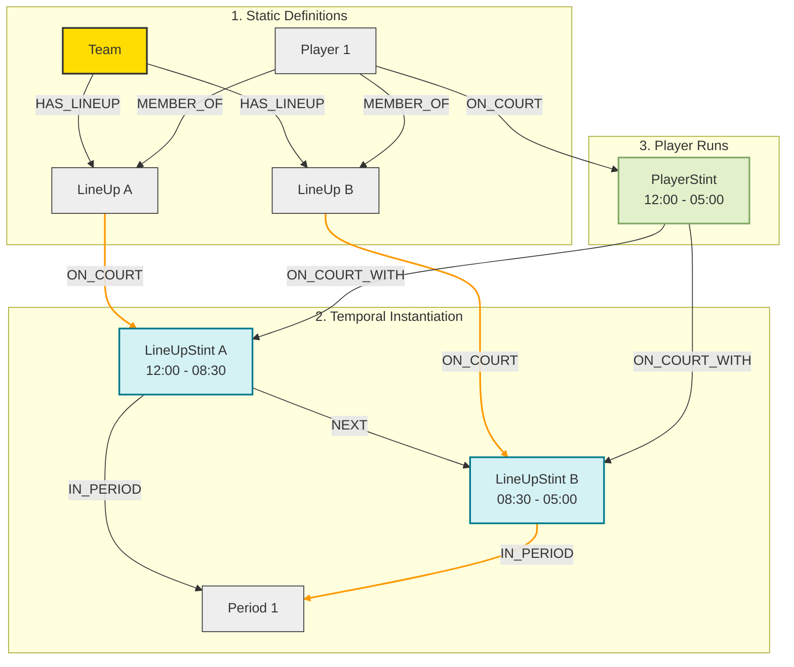
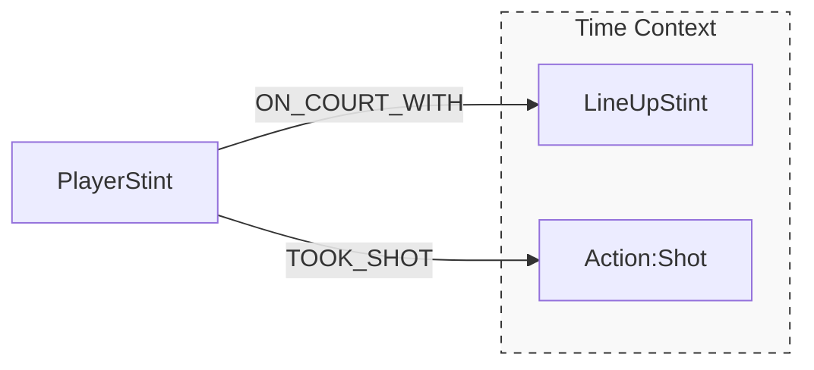
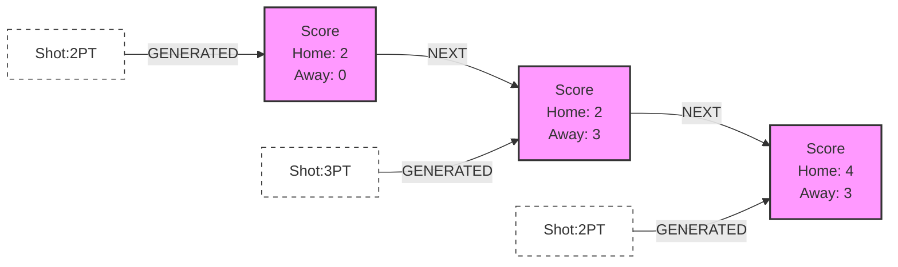

# Game Mechanics
{:.no_toc}

This section details the complex Cypher algorithms used to reconstruct game flow. These queries are located in `src/queries/game.py` and are executed by the `GameManager`.

<details open markdown="block">
  <summary>
    Table of contents
  </summary>
  {: .text-delta }
1. TOC
{:toc}
</details>

---

## The Stint Engine (`MERGE_STINTS`)

The `MERGE_STINTS` query is the heart of the temporal model. It transforms raw substitution logs into a continuous timeline of on-court presence.

### The Algorithm
The query operates in three phases to bridge the gap between "Who is on the team" (Static) and "Who is playing right now" (Temporal).

1.  **LineUp Construction**: Creates `LineUp` nodes for every unique 5-man unit.
2.  **Temporal Instantiation**: Creates `LineUpStint` nodes representing that unit's specific time on the floor (e.g., Q1 12:00 to 08:30).
3.  **Player Aggregation**: Calculates `PlayerStint` nodes. If a player stays on the court while his teammates change, his `PlayerStint` will span multiple `LineUpStint`s.

### Architecture Diagram
The following diagram illustrates how static definitions (Teams/Lineups) instantiate into temporal nodes (Stints) and how individual player runs are aggregated.



### Input Parameters (`$params`)

The query expects a nested structure representing the home and away sides:

```json
{
  "game_id": 22300001,
  "sides": [
    {
      "team_id": 1610612738,
      "lineups": [
        {
          "period": 1,
          "clock": "12:00",
          "global_clock": 0.0,
          "ids": [123, 456, 789, 101, 112]
        }
      ]
    }
  ]
}

```

---

## Event Processing

Events (Shots, Fouls, etc.) are anchored to the timeline using the `global_clock` property. We use specialized queries for each event type (e.g., `MERGE_SHOTS`, `MERGE_FOULS`) to attach specific properties.

### Context Linking

Every Action is linked to the **Context** (`LineUpStint`) and the **Actor** (`PlayerStint`) active at that exact moment.



---

## Score Reconstruction (`MERGE_SCORES`)

Unlike simple box scores, MBAI-GDB reconstructs the score as a **Linked List of States**. The `MERGE_SCORES` query uses a Cypher `reduce()` function to iterate through all scoring events and calculate the running margin.

### The Score Chain

Each `Score` node represents the discrete state of the game *after* a specific shot.



**Key Properties on `Score` Nodes:**

* `home_score`, `away_score`: Integer running totals.
* `margin`: (Home - Away).
* `period_margin`: The score differential within the specific period.

---

## Constraint Definitions (`setup.py`)

To ensure data integrity and query performance, the `BaseManager` enforces the following constraints on startup:

| Label | Property | Constraint Type | Purpose |
| --- | --- | --- | --- |
| `:Team`, `:Player`, `:Game` | `id` | **UNIQUE** | Prevents duplicate entity merging. |
| `:Action`, `:Score` | `id` | **UNIQUE** | Ensures idempotency of event loading. |
| `:LineUpStint`, `:PlayerStint` | `global_clock` | **INDEX** | Accelerates temporal range lookups. |