# MBAI Graph Database
{:.fs-9 .no_toc }

Welcome to the documentation for **MBAI-GDB**, the backend architecture for the [Money Ball AI](https://github.com/lorenzoliuzzo/MBAI) project. 

---

  

    Table of contents
  

  {: .text-delta }
1. TOC
{:toc}

---
# TL;DR
{:.fs-6}

**MBAI-GDB** is an advanced graph ingestion engine that transforms raw, tabular NBA play-by-play data into a high-fidelity **Heterogeneous Temporal Graph** stored in Neo4j.

Traditional sports analytics often rely on aggregated box scores (e.g., relational tables). *MBAI-GDB* breaks this paradigm by modeling basketball as a complex network of interactions. It parses thousands of events per game — shots, assists, fouls, and substitutions — into distinct nodes, linking them temporally via `NEXT` relationships.

**Key Capabilities:**
* **Granular Traversal:** Move seamlessly from a `Season` to a `Game`, down to a specific `Period`, `LineUp`, or individual `Shot`.
* **Context-Aware Analytics:** Analyze player performance not just in isolation, but in the context of specific lineups and opponents.
* **ML-Ready:** Includes a built-in `to_pyg()` pipeline to convert graph data directly into **PyTorch Geometric** tensors for Graph Neural Network (GNN) training.

---
# 🏀 NBA Games as Temporal Hierarchical Heterogeneous Graphs
{:.fs-6}

The goal is to model an entire NBA Regular Season (approx. 1,230 games) with high fidelity. 
At the highest level, the graph organizes the NBA ecosystem into four primary static and semi-static nodes: `Season`, `Team`, `Arena`, and `Game`.

This hierarchy transforms the flat "schedule" into a navigable structure. The `SeasonManager` ingests the schedule and stitches games together, creating a continuous timeline of events.

---
## The `Team`, `Player` and `LineUp` Nodes
{:.fs-5}

The graph differentiates between persistent entities (Teams, Players) and situational entities (LineUps).

* **`Team`**: Represents the franchise. It holds static properties like abbreviation and city, and connects physically to an `Arena`.
* **`Player`**: Represents the individual athlete.
* **`LineUp`**: A unique node representing a specific combination of 5 players. 

*Note:* `LineUp` IDs are deterministically generated by sorting the player IDs, ensuring that any time the same 5 players share the court—regardless of the game or season—they map to the same `LineUp` node.

---
## The `Game` Node 
{:.fs-5}

The `Game` node acts as the central anchor. It enables **context-aware traversal**: by navigating outward from a game, we can immediately identify the physical location (Arena), the temporal context (Season), and the competing entities (Teams).

---
### The `:NEXT` Chain
{:.fs-4}

Games are not isolated events; they exist within a schedule. 
To facilitate trend analysis (e.g., "How does a team perform in the game immediately following a home loss?"), `Game` nodes are linked sequentially via the `:NEXT` relationship.

This structure allows the graph to function as a doubly-linked list of events throughout the season.

### The `Period` Nodes
{:.fs-4}
To allow for precise clock calculations, the `Game` is subdivided into `Period` nodes. 
These represent distinct segments of `RegularTime` (`Q1`-`Q4`) and `Overtime`.

Similar to the game schedule, periods are linked via `:NEXT`. This creates a continuous time spine for the match, allowing linear traversal of the game clock from tip-off to the final buzzer.

{:.note} 
Clock Precision: Every event in the graph is indexed by `global_clock` (cumulative seconds since game start) and `local_clock` (seconds remaining in the period), ensuring O(1) retrieval of events within specific time windows.

```mermaid
graph LR
    classDef game fill:#f9f,stroke:#333,stroke-width:2px;
    classDef period fill:#bbf,stroke:#333,stroke-width:2px;

    G((Game)):::game
    P1((Q1)):::period
    P2((Q2)):::period
    P3((Q3)):::period
    P4((Q4)):::period
    P5((OT1)):::period
    
    P1 & P2 & P3 & P4 & P5 -.->|IN_GAME| G    
    P1 -- NEXT --> P2
    P2 -- NEXT --> P3
    P3 -- NEXT --> P4
    P4 -- NEXT --> P5

    linkStyle default stroke:#ff9900,stroke-width:2px;
    linkStyle 5,6,7,8 stroke:blue,stroke-width:3px;
```

## 🔄 The Stint Engine
{:.fs-5}

One of the project's most advanced features is the automated reconstruction of on-court lineups.

### `LineUpStint` and `PlayerStint` Nodes
The raw NBA data provides substitution events, but not the state of the court between them. MBAI-GDB fills this gap by calculating "Stints":
{:.fs-4}
- **LineUpStints**: The system calculates exactly when a specific 5-man unit enters and leaves the court.
- **PlayerStints**: Aggregates continuous playing time for individual players, linking them to every action that occurred during their shift.

The graph reconstructs the exact flow of substitutions. A `LineUpStint` represents a specific 5-man unit on the court for a specific duration, while `PlayerStint` nodes track an individual player's continuous presence, linking them to the lineup.

### The `:NEXT` and `:ON_COURT_NEXT` Chains
{:.fs-4}

---
# Technical Stack
{:.fs-7}

This project is built using a robust Python-to-Neo4j pipeline:

| Component | Technology | Description |
|:---|:---|:---|
| **Database** | **[Neo4j](https://neo4j.com/)** | Graph storage engine handling complex relationships. |
| **Driver** | **[Python](https://github.com/neo4j/neo4j-python-driver)** | Custom singleton driver for thread-safe connections. |
| **ETL** | **[Pandas](https://github.com/pandas-dev/pandas)** | Data cleaning and normalization before graph ingestion. |
| **Source** | **[NBA API](https://github.com/swar/nba_api)** | Fetches live boxscores, schedules, and play-by-play logs. |

## 🕰️ Temporal Granularity
{:.fs-6 }

- `Period`s are linked sequentially via [:`NEXT`]. This *time chain* allows us to traverse the game from start to finish linearly.
- Every `Period` connects to the `Game` via [:`IN_GAME`].
- Labels like :`RegularTime`:`Q1` or :`OverTime` for easy filtering

nodes linked to the Arena, the Team nodes and to the Season  
 using a heterogeneous graph, so we

Data is ingested from the NBA API and normalized into a rich taxonomy of **Action** nodes:

- Schedule hierararchy: Game nodes are linked to a Season node

- **Scoring**: `Shot` (Made/Missed, 2PT/3PT), `FreeThrow`.
- **Flow**: `Rebound`, `Turnover`, `JumpBall`, `Timeout`.
- **Regulation**: `Foul`, `Violation`.

---
