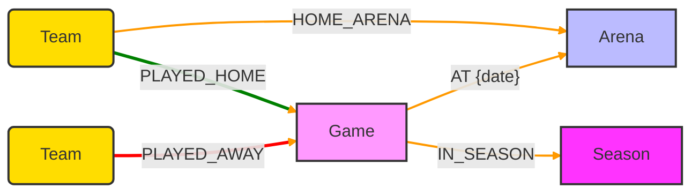
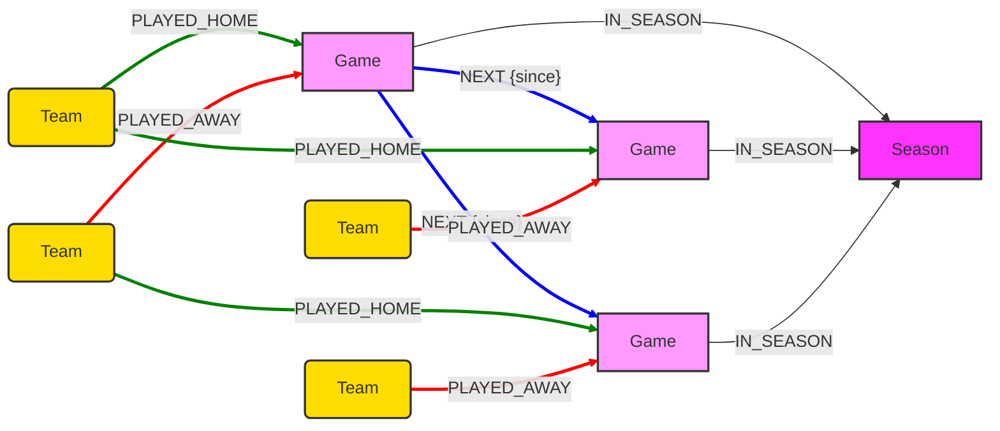
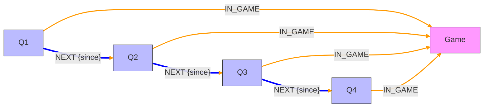
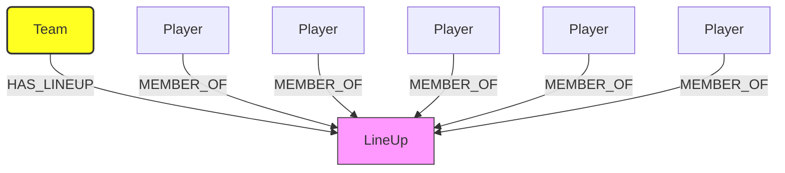
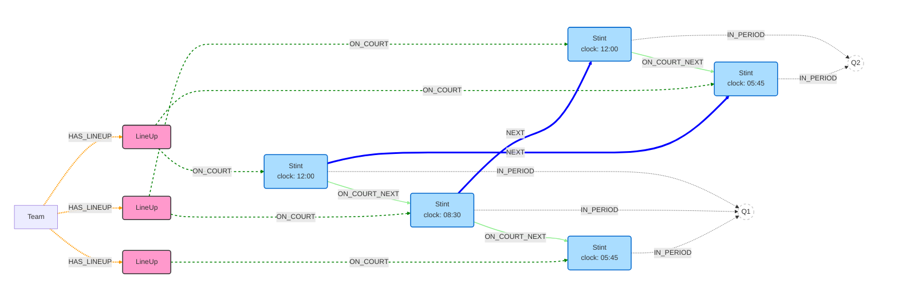
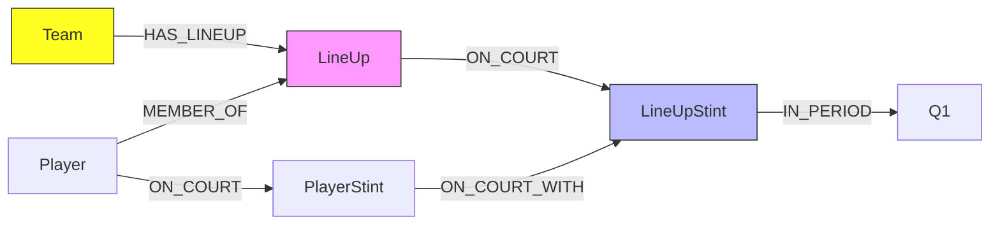

# Schema
{:.no_toc}

This section provides an overview of the technical architecture of the MBAI-gdb project. It covers the main components of the system and how they interact with each other.


<details open markdown="block">
  <summary>
    Table of contents
  </summary>
  {: .text-delta }

1. TOC
{:toc}
</details>

## High-Level Hierarchy
At the highest level, the graph organizes games within a season and locates them physically in arenas. 
This structure supports schedule-based traversal and home/away performance analysis.

### `Team`

### `Season`

### `Game`
The `Game` node is the central anchor. 
It connects `Team`s, `Arena`s, and the specific `Season` context.




Then we create a schedule of the games with the `:NEXT` connection:



### `Period`
To allow for precise clock calculations, the `Game` is subdivided into `Period` nodes. 
These represent distinct segments of `RegularTime` (`Q1`-`Q4`) and `Overtime`.

#### Key Relationships:
- `Period`s are linked sequentially via [:`NEXT`]. This *time chain* allows us to traverse the game from start to finish linearly.
- Every `Period` connects to the `Game` via [:`IN_GAME`].
- Labels like :`RegularTime`:`Q1` or :`OverTime` for easy filtering




### `Player`

### `LineUp`
A `LineUp` is a static set of 5 `Player`s.



## Temporal Architecture: Stint Mechanism
The most complex and powerful component of the MBAI graph is the *stint* engine. 
This reconstructs the exact flow of substitutions to create a hierarchy of on-court configurations.

### `LineUpStint`
When a `LineUp` enters the court, it creates a `LineUpStint` in order to represents the `LineUp` in the specific interval of time where it was active.

(:Team)-[:HAS_LINEUP]->(:LineUp): Connects a franchise to a specific 5-man combination.

(:Player)-[:MEMBER_OF]->(:LineUp): Defines the constituents of the lineup.

(:LineUp)-[:ON_COURT]->(:LineUpStint): The temporal instantiation.

(:LineUpStint)-[:IN_PERIOD]->(:Period): Anchors the stint to a specific quarter.


Then we create a schedule of the games with the `:NEXT` connection:



### `PlayerStint`
While the `LineUpStint` node change every time any player is substituted, a specific player might stay on the court through multiple lineup changes. Thus the `PlayerStint` node to aggregate contiguous `LineUpStint`s for a single `Player`.



<!-- 
```mermaid
graph LR
    HLS[LineUpStint]
    ALS[LineUpStint]
    HLS -- VS {duration} -- ALS    
```
 -->
