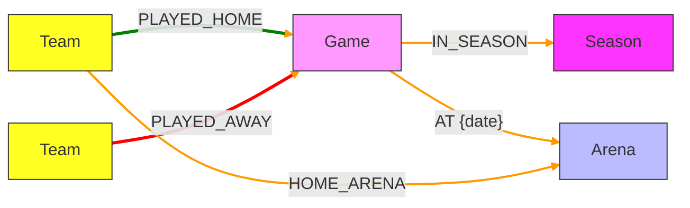
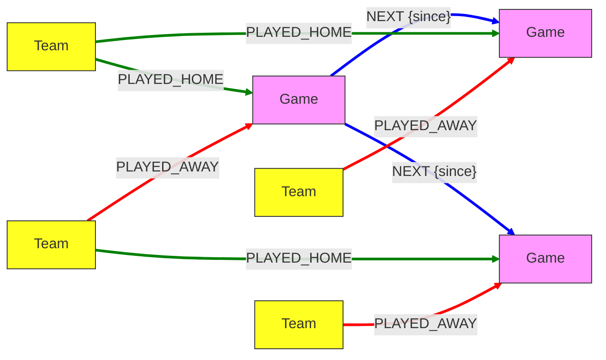
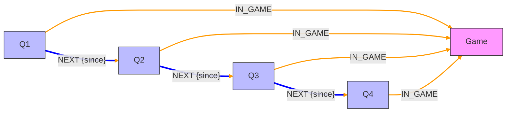
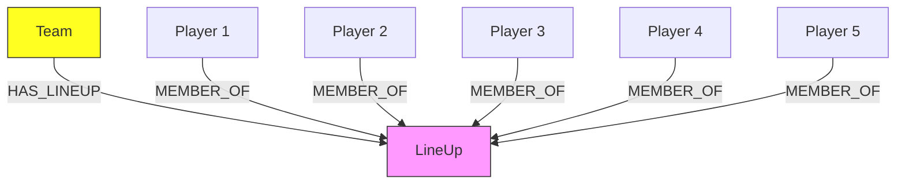
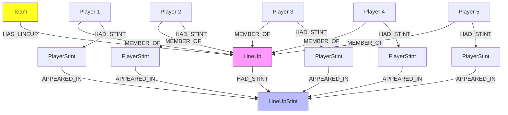
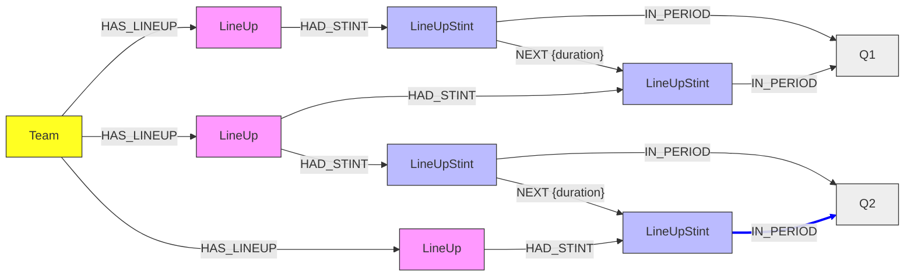

# Schema

This section provides an overview of the technical architecture of the MBAI-gdb project. It covers the main components of the system and how they interact with each other.

## `Game` architecture

### Time Chain with `NEXT`

### `Period` architecture
The `Period` entity represents a distinct segment of game time (e.g., `Q1`, `Q2`, `OT`).

#### Key Relationships:
- `Period`s are linked sequentially via [:`NEXT`]. This *time chain* allows us to traverse the game from start to finish linearly.
- Every `Period` connects to the `Game` via [:`IN_GAME`].
- Labels like :`RegularTime`:`Q1` or :`OverTime` for easy filtering

