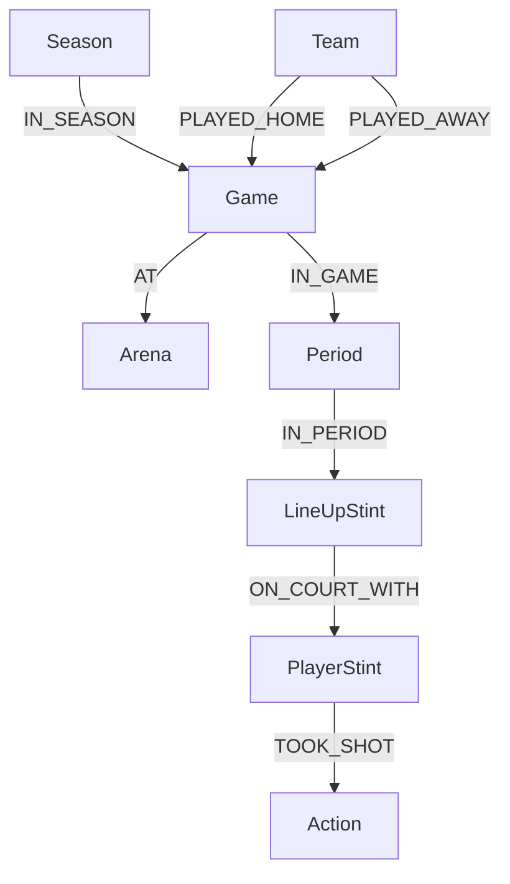

# Schema Reference
{:.no_toc}

This document serves as the data dictionary for the MBAI-GDB. It details the Nodes, Relationships, and Properties defined in the `src/queries` package.

For an explanation of the algorithms used to construct this graph (e.g., how Stints are calculated), please refer to [**Game Mechanics**](./queries/game-mechanics.html).

<details open markdown="block">
  <summary>
    Table of contents
  </summary>
  {: .text-delta }
1. TOC
{:toc}
</details>

---

## High-Level Topology

The graph hierarchy flows from the Season down to the individual play events.



---

## 1. Structural Nodes

These nodes define the physical and logistical framework of the NBA.

### `Team`

Represents an NBA franchise.

* **Source:** `src/queries/team.py`

| Property | Type | Description |
| --- | --- | --- |
| `id` | Integer | Unique NBA Team ID (e.g., `1610612738`). |
| `name` | String | Full team name (e.g., "Boston Celtics"). |
| `abbreviation` | String | Three-letter code (e.g., "BOS"). |
| `city` | String | e.g., "Boston". |
| `state` | String | e.g., "Massachusetts". |

### `Game`

The central anchor for a specific match.

* **Source:** `src/queries/season.py`

| Property | Type | Description |
| --- | --- | --- |
| `id` | Integer | Unique NBA Game ID. |
| `date` | DateTime | The scheduled date of the game. |
| `start` | DateTime | Timestamp of the opening tip-off. |
| `duration` | Duration | Total wall-clock time of the game. |

### `Period`

A temporal subdivision of the game.

* **Source:** `src/queries/game.py`
* **Labels:** `:RegularTime`, `:OverTime`, `:Q1`, `:Q2`, `:Q3`, `:Q4`.

| Property | Type | Description |
| --- | --- | --- |
| `n` | Integer | Period number (1-4 for regulation, >4 for OT). |
| `start` | DateTime | Wall-clock start time. |
| `end` | DateTime | Wall-clock end time. |
| `duration` | Duration | Length of the period. |

---

## 2. Temporal Nodes (The Stint Layer)

These nodes enable the "Plus-Minus" and advanced temporal analytics.

### `LineUp`

A unique combination of 5 players. This is a static definition; it does not contain time data itself.

### `LineUpStint`

A specific interval of time where a `LineUp` was active on the floor.

* **Source:** `MERGE_STINTS` in `src/queries/game.py`

| Property | Type | Description |
| --- | --- | --- |
| `global_clock` | Float | **Index.** Seconds elapsed since game start. |
| `local_clock` | Float | Seconds remaining in the current period (e.g., 720.0 to 0.0). |
| `clock_duration` | Float | Duration of the stint in game-clock seconds. |
| `plus_minus` | Integer | Net point differential during this stint. |
| `points_scored` | Integer | Points scored by this lineup. |
| `points_conceded` | Integer | Points allowed by this lineup. |

### `PlayerStint`

A specific interval where a `Player` was active. Aggregates contiguous `LineUpStint`s.

| Property | Type | Description |
| --- | --- | --- |
| `global_clock` | Float | **Index.** Start time of the player's run. |
| `time_duration` | Duration | Real-time duration of the run. |
| `plus_minus` | Integer | Individual +/- for this run. |

---

## 3. Action Nodes

Events are defined by the base label `:Action` and specific sub-labels.

**Common Properties for all Actions:**

* `global_clock` (Float): Cumulative game time.
* `clock` (Duration): The NBA clock string (e.g., "PT12M00S").
* `time` (DateTime): The exact wall-clock timestamp.

### `Shot`

* **Source:** `MERGE_SHOTS`, `MERGE_FREETHROWS`
* **Labels:** `:Made`, `:Missed`, `:2PT`, `:3PT`, `:FreeThrow`, `:Dunk`, `:Layup`, etc.

| Property | Type | Description |
| --- | --- | --- |
| `points` | Integer | 0, 1, 2, or 3. |
| `x` | Float | X-coordinate on the court (half-court). |
| `y` | Float | Y-coordinate on the court. |
| `distance` | Float | Distance from the hoop in feet. |
| `attempt` | Integer | For Free Throws only (e.g., 1 of 2). |

### `Foul`

* **Labels:** `:Personal`, `:Shooting`, `:Technical`, `:Flagrant`, `:Offensive`.

### `TurnOver`

* **Labels:** `:BadPass`, `:LostBall`, `:Traveling`, `:ShotClock`, `:OffensiveFoul`.

### `Rebound`

* **Labels:** `:Offensive`, `:Defensive`.

---

## 4. Analytics Nodes

### `Score`

Represents the game state *after* a scoring event. Formats a linked list of score changes.

* **Source:** `MERGE_SCORES` in `src/queries/game.py`

| Property | Type | Description |
| --- | --- | --- |
| `home_score` | Integer | Total score for home team. |
| `away_score` | Integer | Total score for away team. |
| `margin` | Integer | (Home - Away). |
| `period_margin` | Integer | Margin considering only points in current period. |

---

## 5. Relationship Reference

| Source Node | Relationship | Target Node | Description |
| --- | --- | --- | --- |
| `Season` | `IN_SEASON` | `Game` |  |
| `Game` | `NEXT` | `Game` | Sequential schedule linking. |
| `Team` | `HAS_LINEUP` | `LineUp` | roster construction. |
| `LineUp` | `ON_COURT` | `LineUpStint` | Instantiates a lineup in time. |
| `PlayerStint` | `ON_COURT_WITH` | `LineUpStint` | Links a player to the team unit. |
| `PlayerStint` | `TOOK_SHOT` | `Shot` |  |
| `PlayerStint` | `ASSISTED` | `Shot` |  |
| `PlayerStint` | `COMMITTED_FOUL` | `Foul` |  |
| `Shot` | `GENERATED_SCORE` | `Score` | Connects the event to the state change. |


---
title: Schema
layout: default
nav_order: 6
has_children: true
has_toc: true
---

# Schema
{:.no_toc}

This section provides an overview of the technical architecture of the MBAI-gdb project. It covers the main components of the system and how they interact with each other.


<details open markdown="block">
  <summary>
    Table of contents
  </summary>
  {: .text-delta }

1. TOC
{:toc}
</details>

## High-Level Hierarchy
At the highest level, the graph organizes games within a season and locates them physically in arenas. 
This structure supports schedule-based traversal and home/away performance analysis.

### `Team`

### `Season`

### `Game`
The `Game` node is the central anchor. 
It connects `Team`s, `Arena`s, and the specific `Season` context.


Then we create a schedule of the games with the `:NEXT` connection:


### `Period`
To allow for precise clock calculations, the `Game` is subdivided into `Period` nodes. 
These represent distinct segments of `RegularTime` (`Q1`-`Q4`) and `Overtime`.

#### Key Relationships:
- `Period`s are linked sequentially via [:`NEXT`]. This *time chain* allows us to traverse the game from start to finish linearly.
- Every `Period` connects to the `Game` via [:`IN_GAME`].
- Labels like :`RegularTime`:`Q1` or :`OverTime` for easy filtering


### `Player`

### `LineUp`
A `LineUp` is a static set of 5 `Player`s.


## Temporal Architecture: Stint Mechanism
The most complex and powerful component of the MBAI graph is the *stint* engine. 
This reconstructs the exact flow of substitutions to create a hierarchy of on-court configurations.

### `LineUpStint`
When a `LineUp` enters the court, it creates a `LineUpStint` in order to represents the `LineUp` in the specific interval of time where it was active.

(:Team)-[:HAS_LINEUP]->(:LineUp): Connects a franchise to a specific 5-man combination.

(:Player)-[:MEMBER_OF]->(:LineUp): Defines the constituents of the lineup.

(:LineUp)-[:ON_COURT]->(:LineUpStint): The temporal instantiation.

(:LineUpStint)-[:IN_PERIOD]->(:Period): Anchors the stint to a specific quarter.


Then we create a schedule of the games with the `:NEXT` connection:


### `PlayerStint`
While the `LineUpStint` node change every time any player is substituted, a specific player might stay on the court through multiple lineup changes. Thus the `PlayerStint` node to aggregate contiguous `LineUpStint`s for a single `Player`.


<!-- 
```mermaid
graph LR
    HLS[LineUpStint]
    ALS[LineUpStint]
    HLS -- VS {duration} -- ALS    
```
 -->
